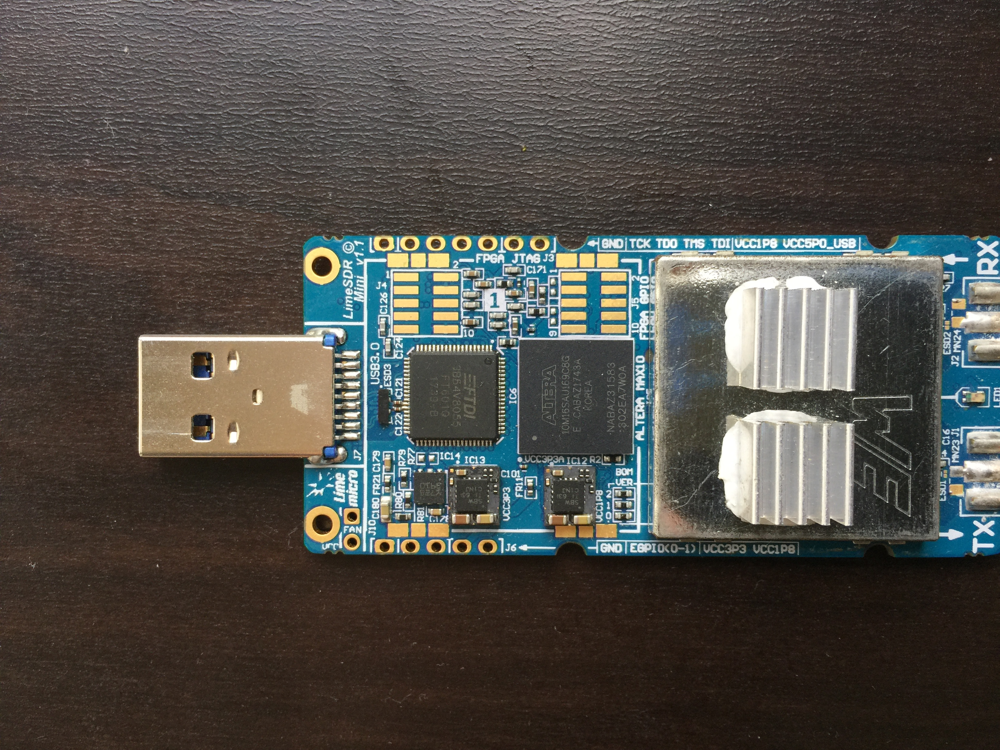

# LimeSDR-Mini FPGA Gateware OpenOCD Programmer

This folder contains configuration files and a Bash Script made to program a LimeSDR-Mini FPGA via JTAG using OpenOCD. 

## Supported Adapters
This script was tested with the following JTAG cables:

- FT2232H
- FT232H
- FT232R
- OLIMEX (Not Tested)

## Required Software
You will need OpenOCD installed. LimeSDR-Mini uses an Altera 10M16 FPGA that is compatible with OpenOCD since the version 0.10.0 released on January 2017. Make sure you are running the latest version of OpenOCD by running the command below in the command line.

``` 
$ openocd -v 
Open On-Chip Debugger 0.10.0
Licensed under GNU GPL v2
For bug reports, read
	http://openocd.org/doc/doxygen/bugs.html
```

## Wiring 
This script uses a JTAG connection to program the FPGA gateware. The JTAG header of the LimeSDR-Mini is located on the side of the device according to the picture below. You will need to connect your cable respective pins to the VCC1P8 (if using FT232R), GND, TCK, TDO, TMS & TDI. A quick reference for this pins is located on the right of the header.



| Cable   | TCK | TDO | TMS | TDI | VCC1P8 |
| ------- | --- | --- | --- | --- | --- |
| FT2232H | ADBUS0 | ADBUS2 | ADBUS3 | ADBUS1 | --- |
| FT232H  | ADBUS0 | ADBUS2 | ADBUS3 | ADBUS1 | --- |
| FT232R  | TXD | RTS | CTS | RXD | VCCIO |

Notes:
If using FT232H or FT2232H, an additional logic level converter is needed, since these chips and LimeSDR-Mini's JTAG's logic voltages are different (3.3V on FT, 1.8V on LimeSDR-Mini).
If using FT232R, a 1kohm pull-up resistor between LimeSDR-Mini's TCK and VCC1P8 pins is needed.
A pull-up resistor might also be needed with FT232H and FT2232H, depending on the logic level converter used (TCK high level voltage must be at least ~1.3V-1.4V)


## Installation 
Make sure the programmer.sh file is executable.

``` 
cd LimeSDR-Mini_GW/LimeSDR-Mini_bitstreams/OpenOCD
chmod u+x programmer.sh
```

## Usage
A .svf programming file is required to be placed in the same folder as the programmer.sh script in order for it to work. The programming file can be generated using Intel Quartus programmer. The file should be named "LimeSDR-Mini_lms7_trx.svf".
After connecting the JTAG header to your adapter and powering the LimeSDR-Mini with a USB Cable, execute the command below in the command line. Remember to change the ADAPTER_NAME to your adapter model listed [here](#supported-adapters).

```
./programmer.sh ADAPTER_NAME
```

Note on .svf file generation : 
While generating the file a value may be entered in the field named "TCK frequency". This value is used to calculate the delays between operations while programming and a lower value results in shorter programming times. This is especially important for programming with FT232R, where using a .svf file generated using the default value (25.0 MHz) results in programming times of 40-60 minutes.
A value of 1MHz has been found to work well with FT232R and FT2232H and in the case of FT232R shortens the programming time down to ~7 minutes.
